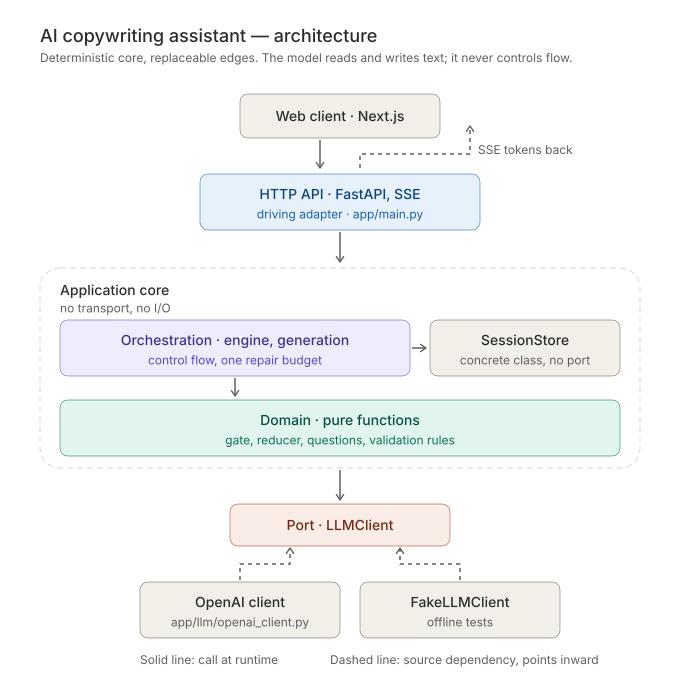

# AI-Powered E-Commerce Copywriting Assistant



Conversational take-home prototype: gather product facts into a typed `ProductBrief`, ask deterministic follow-ups, confirm, then generate a validated product description and marketing email with at most one automatic repair. The web UI is a thin demo — interface polish is not the deliverable.

## Architecture

Inbound adapters (Next.js + assistant-ui, FastAPI SSE) call the application core. The core depends on nothing outside itself. Outbound adapters implement ports declared by the core (`LLMClient`, `SessionStore`). Two interchangeable turn harnesses share the same domain: a hand-written orchestrator on `main`, a Strands Agents harness on `feat/strands`.

- **LLM**: structured extraction, description/email generation, and repair only. It never owns control flow.
- **Reducer / gate / validators / repair budget**: deterministic Python.
- **UI**: chat, live Product Brief (all fields, always visible, toggleable panel), token-streamed description and email body (UX addition beyond the minimum), HTML email preview, validation badge with pass/fail details.

Natural-language interpretation is delegated to structured LLM extraction. The domain operates on structured field states and deterministic invariants. Runtime validation intentionally avoids lexical heuristics that pretend to provide semantic understanding; richer semantic quality checks would be added as evals in a production system.

## File structure

Paths relative to the repository root. Generated and ignored files omitted.

### `backend/app/domain/` — pure domain

| File | Role |
|------|------|
| `models.py` | Pydantic `ProductBrief`, field history and statuses, intents, violation codes, required/optional fields, question priority |
| `reducer.py` | Pure merge of extraction deltas into the brief: overwrites, history, conflict detection |
| `gate.py` | Readiness: needs info, needs clarification, or ready |
| `questions.py` | Next question from field priority and what is still missing |
| `validation/base.py` | Validator type, the default rules, and the function that runs the chain |
| `validation/rules.py` | Price presence, description/email length, CTA, subject length, placeholders |

### `backend/app/orchestration/` — turn flow (`main`)

| File | Role |
|------|------|
| `engine.py` | Conversation orchestrator: turn handling, event stream, early exits, optional-field skip, confirm-before-generate |
| `generation.py` | Copy pipeline: stream description and email, validate, one repair, deliver or fail |
| `answer_guard.py` | Filter on the user message before extraction |
| `session_effects.py` | Session bookkeeping: optional-field progress, assumptions, asked-field memory |
| `messages.py` | Canned assistant copy |
| `responses.py` | API `TurnResponse` and SSE framing |

### `backend/app/strands_runtime/` — `feat/strands` only

Same domain, validators, and `LLMClient`. The turn is a Strands agent with tools and hooks; policy still decides the next tool in Python.

| File | Role |
|------|------|
| `bridge.py` | FastAPI ↔ agent boundary; maps a turn onto an agent run |
| `policy.py` | Pure next-tool decision; domain imports only, no SDK |
| `tool_impl.py` | Implementations of the five tools |
| `tools.py` | Tool declarations the agent sees |
| `hooks.py` | Lifecycle hooks, including a guard that cancels tools not on the allow-list |
| `context.py` | Per-turn context passed between tools |
| `agent_factory.py` | Assemble model, tools, and hooks |
| `model.py` | Strands model adapter |
| `prompts.py` | Agent system prompt |

### `backend/app/llm/` — model adapter

| File | Role |
|------|------|
| `openai_compatible_client.py` | OpenAI-compatible client (OpenRouter by default, `kimi-k3`); credential resolution, prompt load, brief → confirmed/vague facts |
| `fake_client.py` | Deterministic double so the full flow runs without a network |
| `json_utils.py` | Extract and parse JSON from model text |
| `prompts/extract.md` | Intent + field-update extraction |
| `prompts/generate_description.md` | Product description |
| `prompts/generate_email_body.md` | Email body |
| `prompts/generate_email_meta.md` | Subject and CTA |
| `prompts/repair.md` | One repair from the violation list |
| `prompts/judge_chat.md` | LLM-as-judge for live e2e; deliberately outside the `LLMClient` port |

The port itself is `backend/app/ports.py` (`LLMClient`: extract, stream description, stream email body, generate email meta, repair).

### `backend/app/` — composition

| File | Role |
|------|------|
| `main.py` | FastAPI chat + stream endpoints, LLM factory, dependency wiring |
| `store.py` | In-memory session store plus JSON-file adapter |

### `backend/tests/`

Offline (FakeLLM): reducer, gate, validators, domain contracts, orchestrator, one-repair path, conflict resolution, early stream status, acceptance criteria, session store, JSON utils. Live (need a key): `test_live_integration.py`, `test_live_e2e_imba_seat.py`. `test_strands_policy.py` exists only on `feat/strands`.

### `frontend/` — Next.js thin client

`app/page.tsx` composes chat and the brief panel. `components/` holds Chat (assistant-ui), streamed copy sections, Product Brief, and the validation badge. `lib/` is session id, SSE client, stream runtime, mirrored API types, and small view helpers. `constants/index.ts` holds UI labels.

### Also in the repo

- `demos/` — four difficult-user scenarios (contradiction, correction after delivery, prompt injection, vague input) plus transcripts and `NOTES.md`
- `specs/001-ecommerce-copywriting-assistant/` — Spec Kit contract (`spec.md`, `plan.md`, `tasks.md`, data model, API contract)
- `PROJECT_BRIEF.md` — assignment and adopted assumptions
- `AGENTS.md` — agent instructions for this repository
- `.specify/memory/constitution.md` — project principles

## Constraints

Conscious limits. Worth stating before they become a question.

| Constraint | Why it is there |
|------------|-----------------|
| 6–8 hour budget | Assignment. Rules out production infrastructure; forces a choice between what to encode and what to narrate |
| Graded on reasoning, not feature count | Uncertainty handling, decision clarity, LLM vs deterministic split, testability. Not UI, not prompt cleverness |
| Exactly one repair | Assignment. Bounds cost and forbids a retry loop; a second failure of the same kind ends the turn as failure |
| Tests without a network | Assignment. Forces a port and a fake client — the main architectural payoff |
| Two artifact types | Description and email. A type registry would cost more than it saves at two types, so type is not a domain concept yet |
| One provider protocol | Chat completions through a gateway. One adapter covers a class of vendors; features outside that common subset (prompt caching) are unavailable |
| File-backed sessions | JSON on disk is enough for a demo; it does not survive concurrency or multiple instances |
| No auth, no multi-tenant | The session id is the key. There is no user or organization |
| No metrics or traces on `main` | Instrumentation would smear through the orchestrator. `feat/strands` already has hooks |
| Prompts are unversioned markdown | Changing a prompt changes system behavior with no recorded model, parameters, or input schema |
| One language, one category | Flat prompt catalog; brief fields are a fixed type. Fashion would need sizes, electronics a warranty |

## Trade-offs

What was chosen, what was rejected, and when the decision flips.

| Decision | Chosen | Alternative | When I would change |
|----------|--------|-------------|---------------------|
| Control flow | Deterministic orchestrator; the model only reads and writes | Agent loop: less code, odd paths without writing them. Cost: repeatability, tokens, audit | When the number of paths exceeds what you can list, or tools arrive in unknown order |
| Agent framework | `main` by hand; Strands on a side branch | Strands as the delivered path: hooks, tool registry, cleaner policy/execution split. Cost: ~1400 lines and a dependency this assignment does not grade | When you need traces, multiple agents, or Bedrock integration |
| Model output | Schema-constrained JSON | Free text + parsers: any model, including weaker ones. Cost: brittleness and injection surface | Never for extraction. Only if a model has no structured-output support |
| Validation failure | One repair, then fail | Retry until success with a cap: higher pass rate. Cost: time, money, loops | When data shows a second attempt actually saves a material share of cases |
| Session persistence | JSON files behind an interface | Postgres or Redis: concurrency, many instances, queries. Cost: setup, migrations, hours we did not have | First deploy with more than one instance. One adapter; domain unchanged |
| Provider protocol | Chat completions through a gateway | Native Anthropic Messages: prompt caching, vendor-specific features. Cost: lock-in, lose model swap via one env var | When cost dominates. The extract prompt is identical every turn, so caching would be a real saving |
| Directory split | Layers with a extracted domain | Full ports-and-adapters, or a vertical cut per artifact type. Cost: ceremony unjustified at two types | Ports when a second vendor or store appears. Vertical cut at a third artifact type |
| Validation location | `domain/validation/` next to the gate | A sibling `app/validation/` package (the original layout). Same rules, weaker packaging | Already moved onto the domain. Leave it |
| Port location | `app/ports.py`, consumed by orchestration | `llm/base.py` inside the adapter package (the original layout). Full hexagonal would be `application/ports/` | Together with a second adapter |
| Delivering copy | Stream tokens | One payload at the end: simpler, easier to hide unvalidated text. Cost: tens of seconds of blank UI | If validation had to block showing anything before the end |
| Test double | Fake client | Recorded live responses: realism, vendor drift. Cost: fixture rot | When an eval set runs in CI |
| Prompts | Markdown in the repo | Versioned artifact with model, parameters, and input schema. Cost: infra outside the budget | When someone other than the author changes prompts, or at the first A/B |

## What I would build next

Order is what unblocks the next step, not what is most interesting.

1. **Artifact type as a domain concept** — a registry, each type with its own output schema, rules, and prompt. Adding an Instagram post drops from ten files to one catalog entry.
2. **Prompt as a versioned artifact** — text plus model, parameters, and input schema under a version. Without that you cannot explain why last week’s output differed.
3. **Evals in CI** — cases plus a judge, on every prompt or model change. The four demo scenarios are already a seed.
4. **Observability** — traces per turn and per tool, token cost, repair rate, guard-rail hits. Strands hooks are a ready insertion point.
5. **Durable store and concurrency** — Postgres adapter plus optimistic lock on `version`. Domain unchanged.
6. **Category-dependent brief schema** — fields loaded as data, not a frozen type. Fashion gets sizes, electronics a warranty, without a code change.
7. **Multilingual** — language-aware prompts and validators. The prompt catalog stops being flat.
8. **Second provider** — Anthropic Messages or Bedrock, selected by config. The test of the promise: the core must not move.

## Difficult scenarios

Transcripts in `demos/transcripts/`; handling notes in `demos/NOTES.md`.

## Run locally

Prereqs: Node 20+, Python 3.12+, [`uv`](https://docs.astral.sh/uv/).

```bash
npm run setup
# .env: OPENROUTER_API_KEY=...  OPENAI_BASE_URL=https://openrouter.ai/api/v1
#       OPENAI_MODEL=moonshotai/kimi-k3
npm run dev   # API :5001 + UI :5100
```

Open [http://localhost:5100](http://localhost:5100). Avoid `:5000` (macOS AirPlay → HTTP 403).

| Script | What |
|--------|------|
| `npm run dev` | Backend + frontend |
| `npm test` | Offline unit tests (FakeLLM) |
| `npm run test:workers -- 5` | Same offline suite across 5 workers (pytest-xdist) |
| `npm run test:integration` | Live OpenRouter smoke |
| `npm run test:e2e` | Live IMBA SEAT flow + LLM judge (hard 180s budget) |
| `npm run lint` / `npm run typecheck` | Frontend ESLint / `tsc --noEmit` |
| `npm run quality` | lint + typecheck + offline tests |
| `npm run build` | Frontend production build |

Without a key (or `USE_FAKE_LLM=1`) the API uses `FakeLLMClient`.
